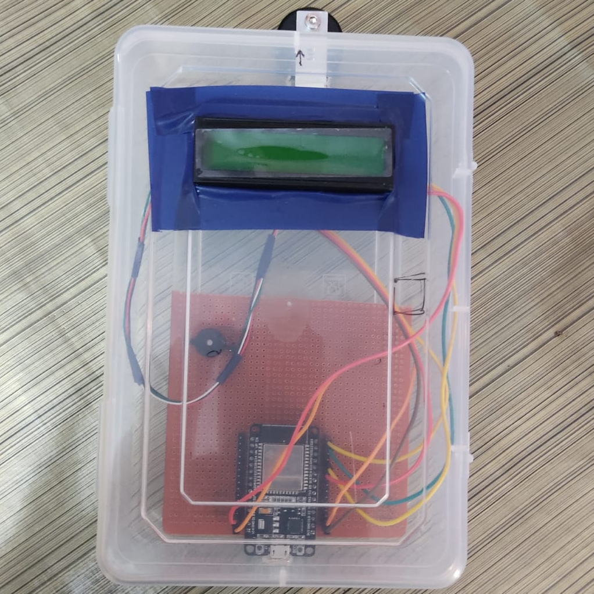

# IoT-Based IV Bag Monitoring System

A real-time monitoring system for IV fluid levels using ESP32 microcontroller and Blynk IoT platform.

  
*Figure 1: Hardware prototype of the IV bag monitoring system showing ESP32, load cell, and LCD display*

## Project Overview

This system provides continuous monitoring of IV fluid levels in medical settings to prevent complications from inadequate monitoring. Key features:

- Real-time weight measurement of IV bags using load cells
- Wireless monitoring via Blynk mobile app
- Alerts when fluid levels are critically low
- LCD display for local monitoring
- Cloud-based data logging

## Hardware Components

- ESP32 Microcontroller
- Load Cell Weight Sensor (5Kg capacity)
- HX711 Amplifier
- 16x2 LCD Display with I2C module
- Resistors and basic electronic components

## Software Requirements

- Arduino IDE
- Blynk IoT Platform
- Required libraries:
  - Blynk
  - HX711
  - LiquidCrystal_I2C

## Setup Instructions

1. **Hardware Assembly**:
   - Connect the load cell to HX711 amplifier
   - Connect HX711 to ESP32 (DOUT to GPIO23, CLK to GPIO19)
   - Connect LCD display via I2C

2. **Software Configuration**:
   - Install required Arduino libraries
   - Configure Blynk template
   - Update WiFi credentials in the code
   - Upload the sketch to ESP32

3. **Blynk App Setup**:
   - Create a new project using the template ID
   - Configure virtual pins V0 (fluid volume) and V1 (percentage)
   - Set up notification alerts

## Usage

1. Power on the system
2. Calibrate the load cell (press reset button if needed)
3. Hang the IV bag on the load cell
4. Monitor levels via LCD or Blynk app
5. System will alert when fluid is low (<20%)

## Contributors

- [**Agney Suresh**](https://github.com/AgneySuresh)
- [**Abijith T**](https://github.com/AbijithT2003)
- **Abhiram Bhaskaran (NSS21EC006)**

Under guidance of Prof. Reshmi S, NSS College of Engineering Palakkad

## License

This project is licensed under the MIT License - see the [LICENSE](LICENSE) file for details.
